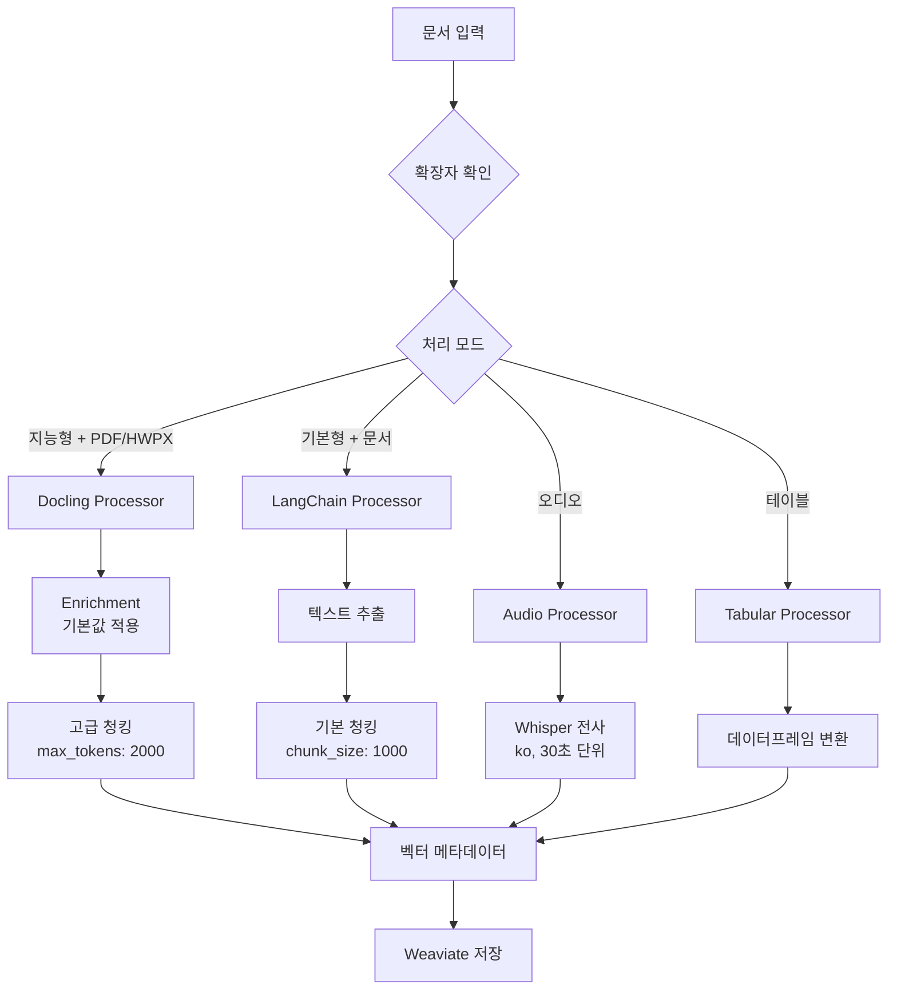

# GenOS Document Intelligence 전처리 시스템 (개발중인 Facade 포맷)

## 📋 개요

GenOS DI(Document Intelligence)는 다양한 형식의 문서를 벡터 데이터베이스에 저장하기 위해 전처리하는 시스템입니다. 
각 문서 타입과 요구사항에 따라 **지능형(Intelligent)** 또는 **기본형(Basic)** 처리 방식을 동적으로 선택할 수 있습니다.

## 🏗️ 시스템 구조

```
genos_di/
├── 핵심 전처리 파일
│   └── new_preprocess_configurable.py # 설정 가능한 전처리기 (확장자별 on/off)
│
├── 유틸리티
│   ├── genos_utils.py                 # 파일 업로드, bbox 병합 등
│   └── utils.py                       # 비동기 처리 유틸리티
│
├── 설정 파일
    └── processor_config.json          # 확장자별 처리 모드 및 기본값 설정

```

### Facade 패턴 구조 (docling/facade/)
```
docling/facade/
├── document_facade.py                 # 메인 Facade (설정 가능)
├── config/
│   └── processor_config.py            # 처리 모드 설정 관리
└── processors/
    ├── docling_processor.py           # PDF/HWPX 지능형 처리
    ├── audio_processor.py             # 오디오 처리 (Whisper)
    ├── tabular_processor.py           # CSV/XLSX 처리
    ├── langchain_processor.py         # 일반 문서 처리
    └── processor_factory.py           # 동적 프로세서 생성
```

## 🚀 DocumentProcessor 사용법

### 기본 사용법

```python
from new_preprocess_configurable import DocumentProcessor

# 프로세서 생성 (processor_config.json의 기본값 자동 로드)
processor = DocumentProcessor()

# 확장자별 모드 설정
processor.set_mode('pdf', 'intelligent')   # PDF를 지능형으로
processor.set_mode('docx', 'basic')        # DOCX를 기본형으로

# 문서 처리
vectors = await processor(request, 'document.pdf')
```

### 일괄 설정

```python
# 모든 확장자를 지능형으로
processor.set_all_intelligent()

# 모든 확장자를 기본형으로
processor.set_all_basic()

# 특정 확장자들만 지능형으로
processor.enable_intelligent_for(['pdf', 'hwpx', 'docx'])

# 특정 확장자들을 기본형으로
processor.disable_intelligent_for(['pptx', 'xlsx'])
```

### 설정 저장/로드

```python
# 현재 설정 저장
processor.save_config('my_config.json')

# 설정 파일 로드
new_processor = DocumentProcessor(config_file='my_config.json')
```

### 사전 설정 프로세서

```python
from new_preprocess_configurable import (
    create_intelligent_processor,  # 모두 지능형
    create_basic_processor,        # 모두 기본형
    create_hybrid_processor        # PDF/HWPX만 지능형 (권장)
)

# 하이브리드 프로세서 (추천)
processor = create_hybrid_processor()
```

## 🔧 세부 옵션 설정 및 기본값

### Enrichment 옵션 (PDF/HWPX) - 지능형 모드
```python
# 기본값이 이미 설정되어 있음
processor.set_enrichment_options('pdf', 
    enabled=True,                      # 기본값: True
    do_toc_enrichment=True,           # 기본값: True
    extract_metadata=True,             # 기본값: True
    toc_extraction_mode='list_items',  # 기본값: 'list_items'
    toc_seed=33,                       # 기본값: 33
    toc_max_tokens=1000,               # 기본값: 1000
    toc_temperature=0.0,               # 기본값: 0.0
    toc_top_p=0                        # 기본값: 0
)

# API 설정 (필요시 변경)
processor.set_enrichment_options('pdf',
    toc_api_base_url="http://llmops-gateway-api-service:8080/serving/364/799/v1/chat/completions",
    toc_api_key="your_api_key"
)

# Enrichment 비활성화
processor.disable_enrichment(['pdf', 'hwpx'])
```

### Pipeline 옵션 (PDF) - 지능형 모드
```python
# 기본값이 이미 설정되어 있음
processor.set_pipeline_options('pdf',
    do_ocr=False,                      # 기본값: False
    do_table_structure=True,           # 기본값: True
    generate_page_images=True,         # 기본값: True
    generate_picture_images=True,      # 기본값: True
    artifacts_path="/nfs-root/models/223/760",  # 기본값: 모델 경로
    table_structure_options={
        'do_cell_matching': True,      # 기본값: True
        'detect_headers': True          # 기본값: True
    }
)

# OCR 활성화 (필요시)
processor.enable_ocr(['pdf'])
```

### Chunking 옵션
```python
# Docling 기반 청킹 (PDF/HWPX) - 지능형 모드
processor.set_chunking_options('pdf',
    max_tokens=2000,                   # 기본값: 2000
    merge_peers=True,                  # 기본값: True
    tokenizer="sentence-transformers/all-MiniLM-L6-v2"  # 기본값
)

# LangChain 기반 청킹 (기타 문서) - 기본형 모드
processor.set_chunking_options('docx',
    chunk_size=1000,                   # 기본값: 1000
    chunk_overlap=200                  # 기본값: 200
)
```

### Whisper 옵션 (오디오)
```python
# 기본값이 이미 설정되어 있음
processor.set_whisper_options('mp3',
    url="http://192.168.74.164:30100/v1/audio/transcriptions",  # 기본값
    model='model',                     # 기본값: 'model'
    language='ko',                     # 기본값: 'ko'
    temperature=0.2,                   # 기본값: 0.2
    chunk_sec=30,                      # 기본값: 30
    response_format='json'             # 기본값: 'json'
)
```

### 특정 옵션 경로 설정
```python
# 개별 옵션 직접 설정
processor.set_processor_option('pdf', 'enrichment.toc_seed', 42)
processor.set_processor_option('pdf', 'pipeline.do_ocr', True)
processor.set_processor_option('pdf', 'chunking.max_tokens', 1536)
```

## 📊 처리 모드 비교

| 모드 | 프로세서 | 장점 | 단점 | 사용 시기 |
|------|----------|------|------|-----------|
| **지능형** | Docling | • AI 기반 구조 분석<br>• 테이블/이미지 처리<br>• Enrichment 지원 | • 처리 시간 김<br>• 리소스 많이 사용 | 고품질 처리 필요시 |
| **기본형** | LangChain | • 빠른 처리<br>• 다양한 형식 지원<br>• 안정적 | • 단순 텍스트 추출<br>• 구조 정보 제한적 | 대량 처리시 |

## 🔧 processor_config.json 완전한 기본값 구조

```json
{
  ".pdf": {
    "mode": "intelligent",
    "processor": "docling",
    "description": "PDF with Docling + Enrichment",
    "options": {
      "enrichment": {
        "enabled": true,
        "do_toc_enrichment": true,
        "extract_metadata": true,
        "toc_extraction_mode": "list_items",
        "toc_seed": 33,
        "toc_max_tokens": 1000,
        "toc_temperature": 0.0,
        "toc_top_p": 0,
        "toc_api_provider": "custom",
        "toc_api_base_url": "http://llmops-gateway-api-service:8080/serving/364/799/v1/chat/completions",
        "metadata_api_base_url": "http://llmops-gateway-api-service:8080/serving/364/799/v1/chat/completions",
        "toc_api_key": "a2ffe48f40ab4cf9a0699deac1c0cb76",
        "metadata_api_key": "a2ffe48f40ab4cf9a0699deac1c0cb76",
        "toc_model": "/model/snapshots/9eb2daaa8597bf192a8b0e73f848f3a102794df5"
      },
      "pipeline": {
        "do_ocr": false,
        "do_table_structure": true,
        "generate_page_images": true,
        "generate_picture_images": true,
        "artifacts_path": "/nfs-root/models/223/760",
        "table_structure_options": {
          "do_cell_matching": true,
          "detect_headers": true
        }
      },
      "chunking": {
        "max_tokens": 2000,
        "merge_peers": true,
        "tokenizer": "sentence-transformers/all-MiniLM-L6-v2"
      }
    }
  },
  ".mp3": {
    "mode": "basic",
    "processor": "audio",
    "description": "Audio transcription with Whisper",
    "options": {
      "whisper": {
        "url": "http://192.168.74.164:30100/v1/audio/transcriptions",
        "model": "model",
        "language": "ko",
        "temperature": 0.2,
        "chunk_sec": 30,
        "response_format": "json"
      },
      "text_splitter": {
        "chunk_size": 1000,
        "chunk_overlap": 200
      }
    }
  },
  ".docx": {
    "mode": "basic",
    "processor": "langchain",
    "description": "Word document with LangChain",
    "options": {
      "text_splitter": {
        "chunk_size": 1000,
        "chunk_overlap": 200
      }
    }
  }
}
```

## 📁 지원 파일 형식

### 문서
- **PDF** (.pdf) - 지능형/기본형 선택 가능
- **HWPX** (.hwpx) - 지능형/기본형 선택 가능
- **Word** (.doc, .docx) - 기본형 (향후 지능형 확장 가능)
- **PowerPoint** (.ppt, .pptx) - 기본형
- **HWP** (.hwp) - 기본형
- **Text** (.txt) - 기본형
- **Markdown** (.md) - 기본형
- **JSON** (.json) - 기본형

### 오디오
- **MP3** (.mp3) - Whisper 전사
- **M4A** (.m4a) - Whisper 전사
- **WAV** (.wav) - Whisper 전사

### 테이블
- **CSV** (.csv) - 테이블 처리
- **Excel** (.xlsx) - 테이블 처리

## 💡 사용 시나리오

### 1. 고품질 문서 처리 (연구/분석)
```python
from new_preprocess_configurable import create_intelligent_processor

processor = create_intelligent_processor()  # 모든 파일 지능형
# 모든 옵션은 기본값 사용
vectors = await processor(request, 'research_paper.pdf')
```

### 2. 대량 문서 처리 (아카이빙)
```python
from new_preprocess_configurable import create_basic_processor

processor = create_basic_processor()  # 모든 파일 기본형
# 빠른 처리를 위한 기본값 사용
vectors = await processor(request, 'document.pdf')
```

### 3. 하이브리드 처리 (균형, 권장)
```python
from new_preprocess_configurable import create_hybrid_processor

processor = create_hybrid_processor()  # PDF/HWPX만 지능형
# 최적의 기본값 조합
vectors = await processor(request, 'document.pdf')
```

### 4. 커스텀 설정
```python
processor = DocumentProcessor()

# 문서 타입별 최적화 (기본값에서 필요한 부분만 변경)
processor.set_mode('pdf', 'intelligent')    # 중요 문서
processor.set_mode('pptx', 'basic')         # 프레젠테이션

# PDF에 대해 특정 옵션만 변경 (나머지는 기본값 유지)
processor.set_enrichment_options('pdf', toc_max_tokens=3000)  # 더 긴 목차
processor.enable_ocr(['pdf'])  # OCR 활성화

processor.save_config('project_config.json')
```

## 🔄 처리 흐름



## 🔍 메타데이터 필드

모든 처리기는 다음 표준 메타데이터를 생성합니다 (기본값 보장):

| 필드 | 타입 | 기본값 | 설명 |
|------|------|--------|------|
| text | str | "" | 청크 텍스트 |
| n_char | int | 0 | 문자 수 |
| n_word | int | 0 | 단어 수 |
| n_line | int | 0 | 줄 수 |
| i_page | int | 0 | 시작 페이지 |
| e_page | int | 0 | 끝 페이지 |
| i_chunk_on_page | int | 0 | 페이지 내 청크 인덱스 |
| n_chunk_of_page | int | 0 | 페이지 총 청크 수 |
| i_chunk_on_doc | int | 0 | 문서 전체 청크 인덱스 |
| n_chunk_of_doc | int | 0 | 문서 총 청크 수 |
| n_page | int | 0 | 문서 총 페이지 수 |
| reg_date | str | 현재시간 | 등록 일시 |
| chunk_bboxes | str | "[]" | 바운딩 박스 (JSON) |
| media_files | str | "[]" | 미디어 파일 (JSON) |

## 🚨 주의사항

1. **Whisper 서버**: 오디오 처리를 위해 Whisper 서버가 실행 중이어야 함
   - 기본 URL: `http://192.168.74.164:30100/v1/audio/transcriptions`
2. **메모리 관리**: 대용량 문서 처리 시 메모리 사용량 모니터링 필요
3. **파일 권한**: 임시 파일 생성을 위한 쓰기 권한 필요
4. **의존성**: Docling, LangChain, Pandas 등 필수 패키지 설치 필요
5. **기본값 변경**: processor_config.json을 직접 수정하거나 API 사용
